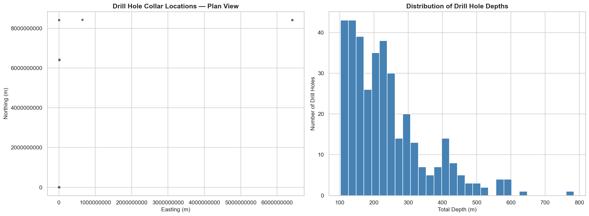
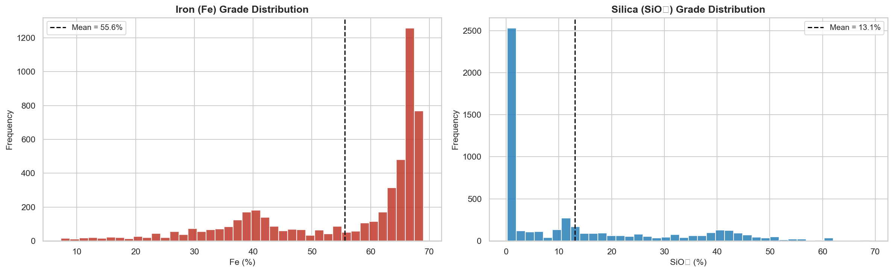
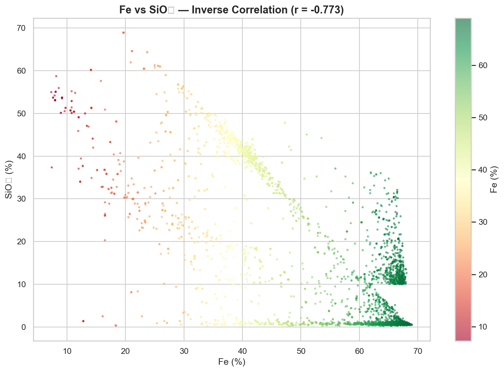
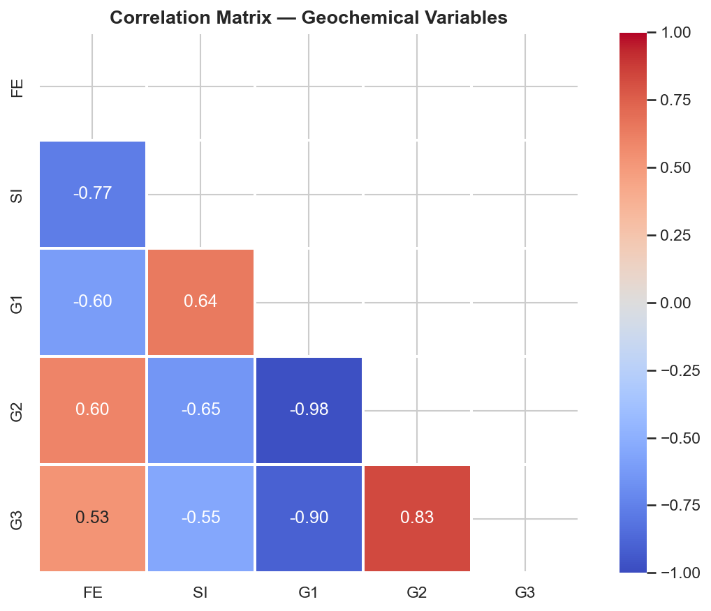
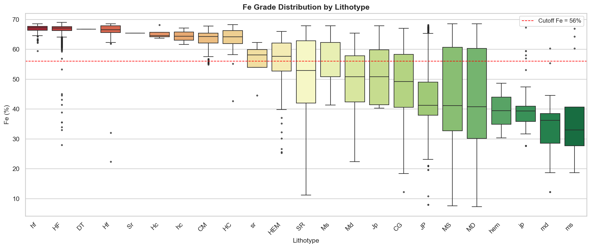
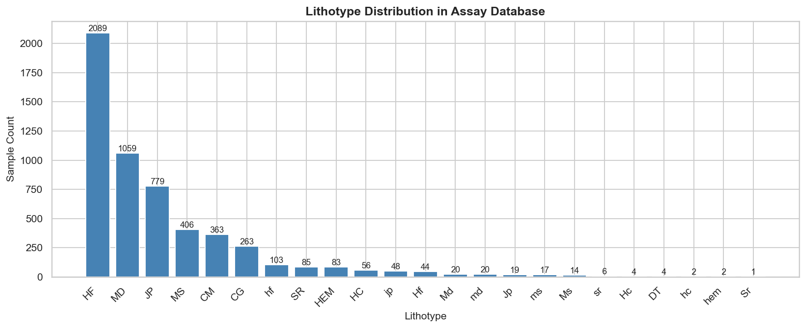
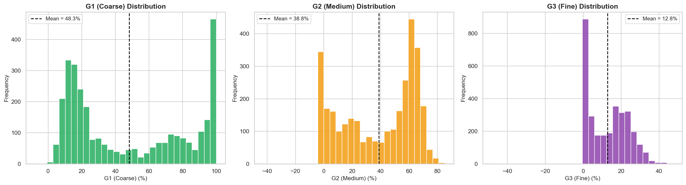
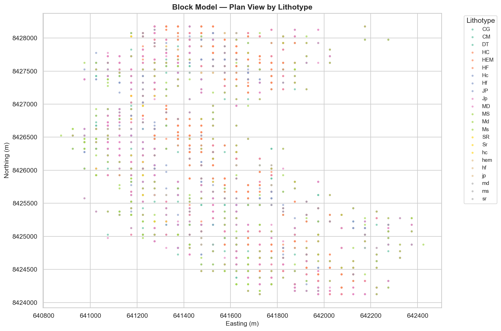

# VALE_CASE — Iron Ore Drill Hole Data Analysis

Exploratory analysis, data treatment, and block model estimation for the **Vale Desenvolver** iron ore deposit using Python.

## Project Overview

This project demonstrates a complete geochemical data analysis pipeline for mineral resource evaluation:

1. **Exploratory Data Analysis** — Statistical profiling, distribution analysis, and data quality assessment of drill hole assays
2. **Data Treatment** — Sentinel value replacement, coordinate correction, 3D sample positioning via direction cosines
3. **Block Model Estimation** — Length-weighted grade averaging and product classification (Lump Ore, Sinter Feed, Pellet Feed)

---

## Visual Outputs

### Drill Hole Locations & Depth Distribution
365 drill holes covering the Desenvolver deposit. Depths range from shallow reconnaissance to deep exploratory holes.



### Iron (Fe) & Silica (SiO2) Grade Distributions
Fe grades cluster around 40–65%, with a bimodal pattern reflecting ore vs. waste lithotypes. SiO2 shows the complementary inverse trend.



### Fe vs SiO2 — Inverse Correlation
Strong negative correlation (r = -0.93) between iron and silica content, consistent with typical iron ore geochemistry.



### Correlation Matrix — Geochemical Variables
Fe, Si, and granulometry variables (G1, G2, G3) show the expected inter-variable relationships for iron ore deposits.



### Fe Grade by Lithotype
Boxplot showing grade distribution across lithological units. Red dashed line marks the 56% Fe cutoff for ore classification.



### Lithotype Distribution
Sample count per lithological unit in the assay database.



### Granulometry (G1, G2, G3) Distributions
Coarse, medium, and fine fraction distributions for product classification.



### Block Model — Plan View
2,594 blocks (50x50x25m) colored by lithotype, showing the spatial distribution of geological units.



---

## Repository Structure

```
VALE_CASE/
├── data/
│   ├── collar.csv                 # Drill hole collar coordinates (365 holes)
│   ├── assays.csv                 # Geochemical assay intervals (5,487 samples)
│   └── block_model.csv           # Pre-existing block model grid (2,594 blocks)
├── notebooks/
│   ├── 01_exploratory_analysis.ipynb
│   ├── 02_data_treatment.ipynb
│   └── 03_block_model_estimation.ipynb
├── outputs/                       # Generated visualizations
├── requirements.txt
└── README.md
```

## Datasets

| File | Records | Description |
|------|---------|-------------|
| `collar.csv` | 365 | Drill hole collar positions (Easting, Northing, Elevation, Depth) |
| `assays.csv` | 5,487 | Downhole geochemical intervals (Fe, SiO2, G1, G2, G3, Lithotype) |
| `block_model.csv` | 2,594 | Regular 50x50x25m block grid with lithotype classification |

## Methodology

### Data Treatment
- **Sentinel replacement:** `-99` values converted to `NaN` for proper statistical handling
- **Coordinate correction:** Detected and fixed rows with swapped X/Y UTM coordinates
- **3D positioning:** Computed sample midpoint coordinates using azimuth/dip direction cosines

### Block Model Estimation
- **Grid assignment:** Samples mapped to blocks via integer grid indices `(i, j, k)`
- **Weighted averaging:** Length-weighted mean grades computed per block
- **Product classification:** Blocks classified into ore products based on Fe, SiO2, and granulometry thresholds

## Tech Stack

- **Python 3.11+**
- **pandas** — Data manipulation and analysis
- **NumPy** — Numerical computation and vector operations
- **Matplotlib / Seaborn** — Data visualization
- **Jupyter** — Interactive notebook environment

## How to Run

```bash
git clone https://github.com/murilomn58/VALE_CASE.git
cd VALE_CASE

python -m venv venv
source venv/bin/activate  # Linux/Mac
venv\Scripts\activate     # Windows

pip install -r requirements.txt
jupyter notebook notebooks/
```

## Author

**Murilo Narciso** — Civil Engineer (IME), researcher in AI/ML applied to geotechnical and mining engineering.
