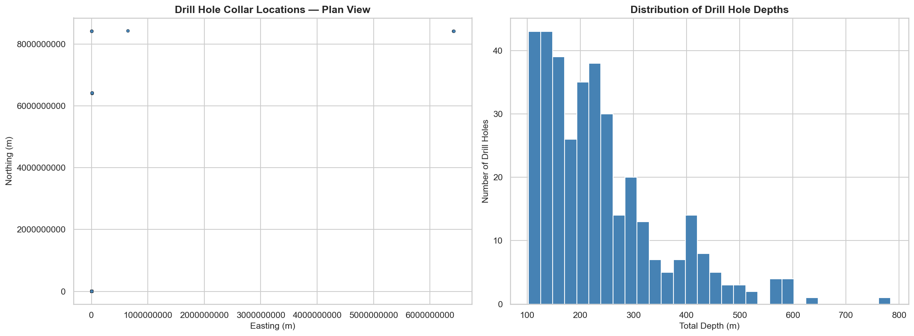
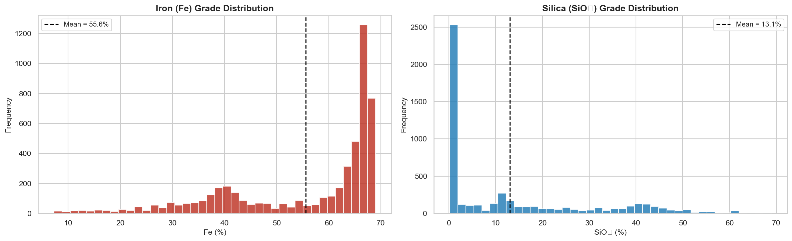
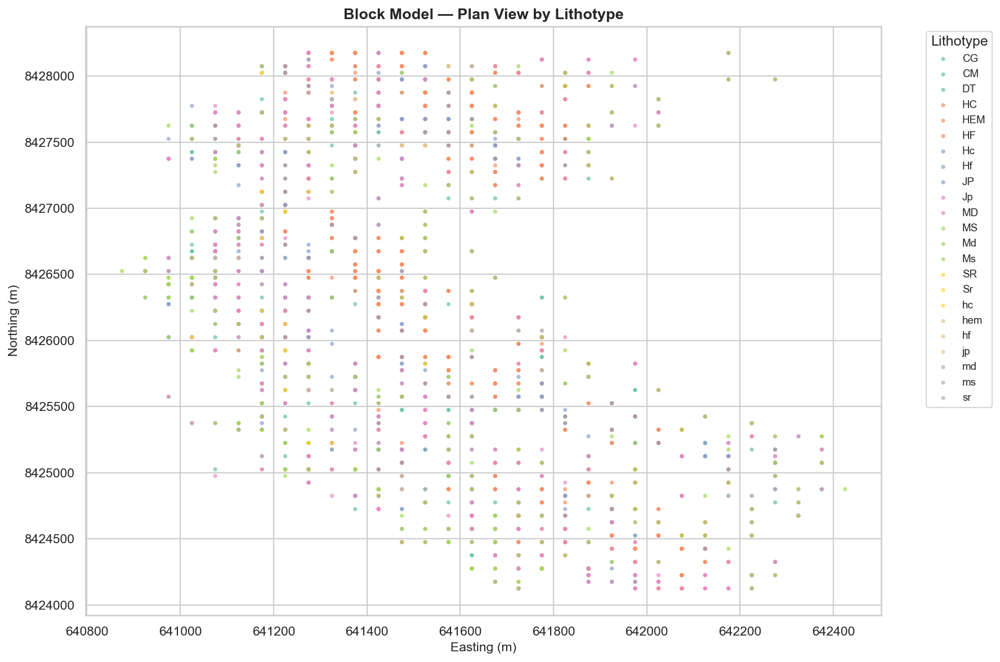

# VALE Case

Análise de dados de sondagem de minério de ferro do case Vale Desenvolver. O projeto usa Python para examinar a qualidade das amostras, corrigir inconsistências e estimar teores em uma malha de blocos.



## O que foi implementado

- Análise exploratória dos teores de ferro, sílica e variáveis granulométricas.
- Tratamento de valores sentinela, correção de coordenadas e posicionamento das amostras em três dimensões.
- Estimativa por média de teores ponderada pelo comprimento dos intervalos.
- Classificação dos blocos em categorias de produto a partir de critérios de teor e granulometria.

## Dados e resultados

| Arquivo | Conteúdo | Registros |
| --- | --- | ---: |
| `data/collar.csv` | Coordenadas e orientação dos furos | 365 |
| `data/assays.csv` | Intervalos de amostragem e resultados geoquímicos | 5.487 |
| `data/block_model.csv` | Malha de blocos de 50 × 50 × 25 m | 2.594 |





As estimativas desta versão usam médias ponderadas. O código publicado não implementa krigagem nem classificação com Random Forest.

## Executar

Requisitos: Python 3.11 ou superior. Crie e ative um ambiente virtual antes de instalar as dependências.

```bash
python -m pip install -r requirements.txt
jupyter notebook notebooks/
```

Leia os notebooks na ordem: análise exploratória, tratamento e estimativa do modelo de blocos. Para gerar as figuras da pasta `outputs/`:

```bash
python generate_outputs.py
```

## Tecnologias

Python, pandas, NumPy, Matplotlib, Seaborn e Jupyter.

## Autor

[Murilo Narciso](https://www.linkedin.com/in/murilonarciso/). Engenharia, análise de dados e IA aplicada.
